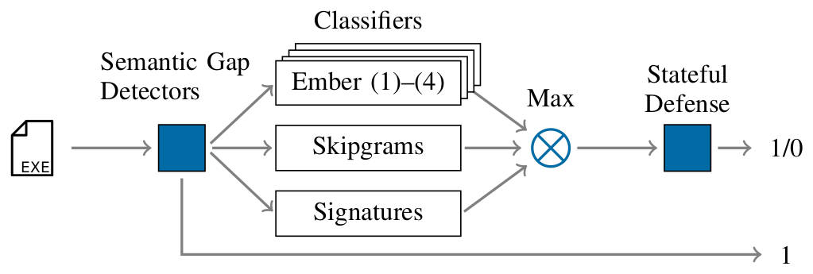

# Against All Odds: Winning the Defense Challenge in an Evasion Competition with Diversification

This repository contains the defense *PEberus** that got the first place in the
[Machine Learning Security Evasion Competition 2020](https://mlsec.io/),
resisting a variety of attacks from independent attackers.

You can find the whitepaper that outlines our defense here:

---

[
Erwin Quiring, Lukas Pirch, Michael Reimsbach, Daniel Arp, Konrad Rieck. *Against All Odds: Winning the Defense Challenge in an Evasion Competition with Diversification*, 2020
](https://arxiv.org/abs/2010.09569)

---

<sub>*PEberus --- Named after the mythic three-headed dog Cerberus, recently seen
as guard in Hogwarts.</sub>

## Bibtex
If you are using our defense, please cite our whitepaper.
You may use the following BibTex entry:
```
@misc{quiring2020competition,
        title={Against All Odds: Winning the Defense Challenge in an Evasion Competition with Diversification},
        author={Erwin Quiring and Lukas Pirch and Michael Reimsbach and Daniel Arp and Konrad Rieck},
        year={2020},
        eprint={2010.09569},
        archivePrefix={arXiv},
        primaryClass={cs.CR}
  }
```

## Summary
Machine learning-based systems for malware detection operate in a
hostile environment. Consequently, adversaries will also target the learning
system and use evasion attacks / adversarial examples to bypass the detection
of malware. The competition gives us the unique opportunity to examine such
attacks under a realistic scenario.

<p align="center">

</p>

Our solution is based on diversification and consists of three main
concepts:
- Various heuristics address the semantic gap. This gap between
the semantics of a PE program and its feature representation
allows relatively simple functionality-preserving attacks.
- Multiple classification models use distinct feature sets to
classify malware reliably while considering targeted attacks against
the model.
- A stateful defense finally detects iterative attacks that
exploit the API access to the classifier.

The developed defense highlights that existing machine learning methods
can be hardened against attacks by thoroughly analyzing the attack surface and
implementing concepts from adversarial learning.
Although our solution fends off the majority of attacks in the
competition, it is limited to static analysis, and thus a few attacks
based on obfuscation succeeded.

Our defense can serve as an additional baseline in the future to strengthen the
research on secure learning.

## Getting Started
The code and models will be publicly available until February/March 2021 ~~in January~~.
